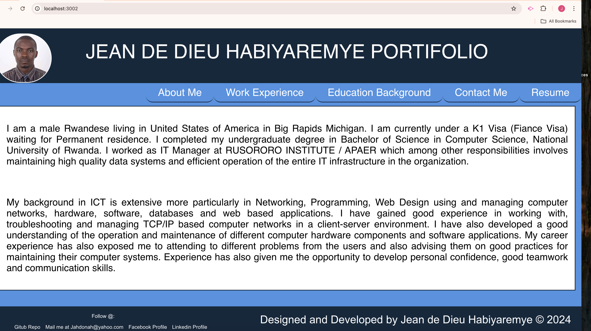
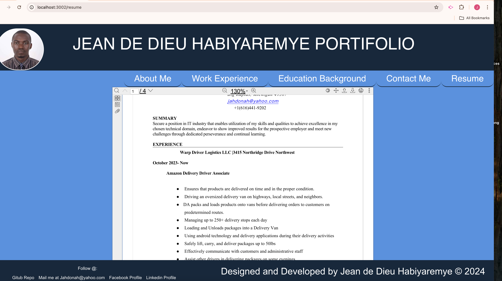

# React + Vite + Portifolio
## Description
A portfolio is a compilation of academic and professional materials that exemplifies your beliefs, skills, qualifications, education, training, and experiences. It provides insight into your personality and work ethic.
My React Portifolio runs in the browser, it was deployed on netlify. 

## Table of Contents
1. [Description](#description)
2. [Table of Contents](#table-of-contents)
3. [Installation && Usage](#installation-and-usage)
4. [License](#license)
5. [Technologies Employed](#technologies-employed)
6. [Contributing](#contributing)
7. [Tests](#tests)
8. [Questions](#questions)


### User Story

```md
AS A developer, I want to build  a  portifolio that uses the latest technology so that an Employer who is
 looking for a candidates with experience building single-page applications could find me matching his criteria
Employer who want  to view a potential employee's deployed React portfolio of work samples
SO THAT he  can assess whether I'm a good candidate for an open position
```

### Acceptance Criteria 

```md
GIVEN a single-page application portfolio for a web developer
WHEN I load the portfolio
THEN I am presented with a page containing a header, a section for content, and a footer
WHEN I view the header
THEN I am presented with the developer's name and navigation with titles corresponding to different sections of the portfolio
WHEN I view the navigation titles
THEN I am presented with the titles About Me, Portfolio, Contact, and Resume, and the title corresponding to the current section is highlighted
WHEN I click on a navigation title
THEN the browser URL changes and I am presented with the corresponding section below the navigation and that title is highlighted
WHEN I load the portfolio the first time
THEN the About Me title and section are selected by default
WHEN I am presented with the About Me section
THEN I see a recent photo or avatar of the developer and a short bio about them
WHEN I am presented with the Portfolio section
THEN I see titled images of six of the developer’s applications with links to both the deployed applications and the corresponding GitHub repositories
WHEN I am presented with the Contact section
THEN I see a contact form with fields for a name, an email address, and a message
WHEN I move my cursor out of one of the form fields without entering text
THEN I receive a notification that this field is required
WHEN I enter text into the email address field
THEN I receive a notification if I have entered an invalid email address
WHEN I am presented with the Resume section
THEN I see a link to a downloadable resume and a list of the developer’s proficiencies
WHEN I view the footer
THEN I am presented with text or icon links to the developer’s GitHub and LinkedIn profiles, and their profile on a third platform (Stack Overflow, Twitter)

```

## Installation and Usage
This application is deployed to [Netlify](https://main--cute-zabaione-2e2be8.netlify.app/).


The following image shows the application's ```about me``` file:


</br>
The following image shows the application's resume diplay

</br>

## License
This project is licensed under the MIT license.

A short and simple permissive license with conditions only requiring preservation of copyright and license notices. Licensed works, modifications, and larger works may be distributed under different terms and without source code.<p/>For more information visit [MIT Licensing](https://choosealicense.com/licenses/mit/).

## Technologies Employed
* CSS
* JavaScript
* React
* Express
* NodeJS
* Vite
* React Pdf viewer
* pdfjs-dist


## Contributing
We'd like to get feedback from who ever needs to contribute and together we can go further
## Tests
No tests were run to complete this CMS.

## Questions
Find Jean de Dieu Habiyaremye on [GitHub](https://github.com/jahdona/)<br/>
Or visit My Portifolio's repository: [Portifolio](https://github.com/jahdona/Myreact-Portifolio)

- - -
© 2024 Just Another Portifolio: My React Portifolio by Jean de Dieu Habiyaremye Creative Services, Confidential and Proprietary. All Rights Reserved.
